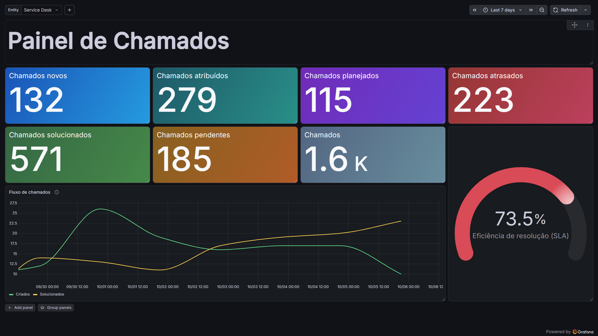

# GLPI Service Desk Dashboard

[](https://github.com/tsathler/glpi-service-desk-dashboard/actions/workflows/ci.yml)

A Grafana dashboard for GLPI Service Desk data stored in an external MariaDB database. This repository runs Grafana only; metric SQL is versioned alongside the dashboard.

## Overview

Milestones 1, 2, and 3 are complete. The **GLPI Service Desk** dashboard and the later **Eficiência de resolução (SLA)** Gauge were validated in the test environment against GLPI and direct SQL. See [database findings](docs/database.md), [metric definitions](docs/metrics.md), and [milestone status](docs/milestones.md).

## Goals

Provide a reproducible view of ticket status, flow, and TTR compliance with read-only database access.

## Architecture

See [docs/architecture.md](docs/architecture.md).

## Features

- Six current-state ticket cards filtered by the **Entity** selector.
- **Fluxo de chamados** time series with Criados, Solucionados, and Saldo.
- **Eficiência de resolução (SLA)** Gauge based on GLPI's calculated TTR deadline.
- Provisioned MySQL datasource and dashboard, persistent Grafana volume, and versioned read-only SQL.

## Stack

Grafana 13, MariaDB, SQL, Docker Compose, Linux, and GitHub Actions.

## Repository Structure

Dashboard JSON and provisioning live under `grafana/`. Metric queries are in `sql/queries/`; schema discovery scripts are in `sql/discovery/`. See [development instructions](docs/development.md).

## Requirements

A Linux host with Docker Engine and Docker Compose, plus a reachable GLPI MariaDB database for data queries. Grafana can start without database connectivity.

## Configuration

Each environment keeps its own local `.env`. Copy `.env.example` to `.env` and replace every placeholder on the development machine and again on the test environment. Only `.env.example` is versioned; never commit `.env` or environment-specific values.

## Database Access

Use a dedicated database account with `SELECT` permission only. See [docs/security.md](docs/security.md) and [docs/database.md](docs/database.md).

## Running

```sh
docker compose up -d
```

Open `http://localhost:3000` and sign in with the configured Grafana admin credentials. See [docs/development.md](docs/development.md) for operations and validation.

## Dashboard

The provisioned **GLPI Service Desk** dashboard has six status cards, an entity selector, **Fluxo de chamados**, and **Eficiência de resolução (SLA)**. The cards show current snapshots; the time series and Gauge follow the selected time range. The Gauge measures TTR compliance among solved tickets with an applicable deadline.

## Screenshot

The dashboard screenshot is not included yet. Add it manually at `docs/images/dashboard-overview.png` when available.

<!--  -->

## Metrics

Metric definitions and validation status are in [docs/metrics.md](docs/metrics.md). The dashboard's read-only queries are versioned in `sql/queries/`.

## Security

See [docs/security.md](docs/security.md). The current test setup keeps MariaDB bound to localhost and uses a dedicated read-only account.

## Validation

GitHub Actions checks Compose, JSON, YAML, Markdown, read-only SQL, query/dashboard parity, Git whitespace, and environment file tracking. CI does not connect to GLPI or deploy. Runtime checks belong in the test environment after `git pull`; see [docs/development.md](docs/development.md).

## AI-assisted development

AI tools supported research, implementation, and documentation. Architecture, SQL, security, runtime behavior, and metric results were reviewed and validated manually against the test environment and GLPI interface.

## Limitations

Direct SQL depends on the installed GLPI schema. Validate schema mappings and metric results again when deploying to another GLPI installation.

## Roadmap

Milestone 1: Foundation (complete). Milestone 2: Database Discovery (complete). Milestone 3: Core Metrics (complete). Milestone 4: Backlog Dashboard (planned).
