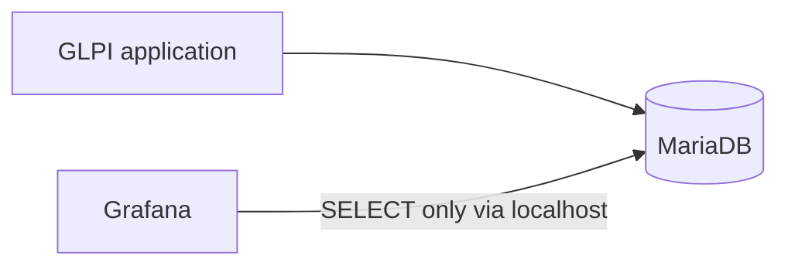

# Architecture

GLPI remains an existing external application. Its database is also external; Compose contains only Grafana. Grafana queries MySQL directly through its native data source, keeping the first version small and avoiding a custom backend, ETL, and an additional metrics store.

Prometheus is not used because the initial subject is relational ticket data, not time-series infrastructure telemetry. The GLPI API is not used because read-only SQL against the reporting database is the selected initial path. Database access must use a dedicated least-privilege account. Direct SQL couples queries to the GLPI schema, so schema and version discovery must precede metric implementation.

In the current test environment, GLPI, MariaDB, and Grafana run on the same Linux host. MariaDB remains bound to localhost (`127.0.0.1:3306`), and Grafana uses `network_mode: host` so the container can reach the local database without exposing port 3306 to the network. Container-to-localhost connectivity has been validated. This is a decision for the current test host layout, not a universal project requirement.

The previous connection attempt through the host's network IP did not work because MariaDB accepts local connections only. A dedicated account, `grafana_reader@localhost`, has only `SELECT` access to `glpi.*`. Direct MariaDB authentication, database access, and a read-only query were validated; no data values or row counts are recorded. The provisioned **GLPI MySQL** datasource reports a healthy connection to database `glpi` using MySQL proxy access.

Grafana is running and its web interface is accessible on TCP/3000. Access to that port is restricted by the host firewall to trusted networks. MariaDB port 3306 is not exposed to the network for Grafana access.

Grafana can start without MariaDB being reachable; data queries require connectivity and valid local credentials. The Grafana administrator and MariaDB reader are separate accounts with separate credentials.
