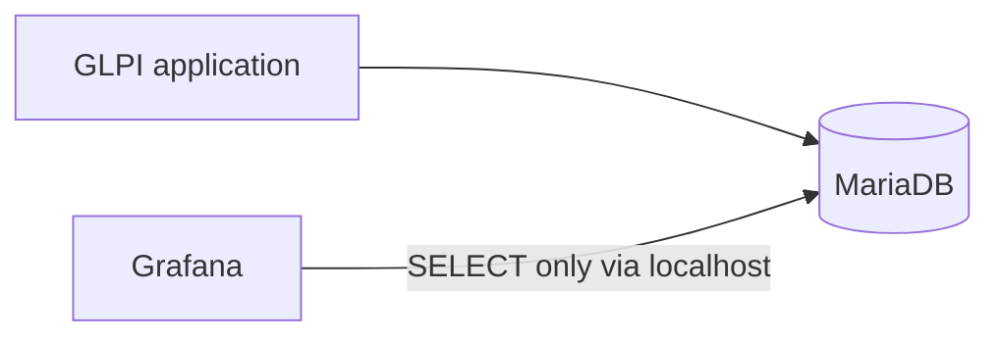

# Arquitetura

O GLPI continua sendo uma aplicação externa já existente. Seu banco também é externo; a stack principal do Compose contém apenas o Grafana. O Grafana consulta o MySQL diretamente por meio de seu datasource nativo, mantendo a primeira versão simples e evitando um backend personalizado, ETL e um armazenamento adicional de métricas. A [demonstração sintética](../demo/README.md) opcional usa uma stack Compose separada, com seu próprio volume MariaDB, e reutiliza o mesmo dashboard, o provisioning do datasource e o SQL das métricas.

O Prometheus não é usado porque o foco inicial são dados relacionais de chamados, e não telemetria de infraestrutura em séries temporais. A API do GLPI não é usada porque o caminho inicial escolhido é SQL read-only no banco de relatórios. O acesso ao banco deve usar uma conta dedicada com o mínimo de privilégios. O SQL direto vincula as queries ao schema do GLPI; por isso, o discovery do schema e da versão deve preceder a implementação das métricas.

No ambiente de testes atual, GLPI, MariaDB e Grafana executam no mesmo host Linux. O MariaDB permanece vinculado ao localhost (`127.0.0.1:3306`), e o Grafana usa `network_mode: host` para que o container alcance o banco local sem expor a porta 3306 à rede. A conectividade do container com o localhost foi validada. Essa decisão atende à configuração atual do host de testes e não é um requisito universal do projeto.

A tentativa anterior de conexão pelo IP de rede do host não funcionou porque o MariaDB aceita somente conexões locais. A conta dedicada `grafana_reader@localhost` tem apenas acesso `SELECT` a `glpi.*`. A autenticação direta no MariaDB, o acesso ao banco e uma query read-only foram validados; nenhum valor de dado ou contagem de linhas foi registrado. O datasource provisionado **GLPI MySQL** informa uma conexão saudável com o banco `glpi` usando acesso proxy do MySQL.

O Grafana está em execução e sua interface web está disponível em TCP/3000. O firewall do host restringe o acesso a essa porta às redes confiáveis. A porta 3306 do MariaDB não é exposta à rede para acesso do Grafana.

O Grafana pode iniciar sem que o MariaDB esteja acessível; as queries de dados exigem conectividade e credenciais locais válidas. O administrador do Grafana e o leitor do MariaDB são contas separadas, com credenciais distintas.
