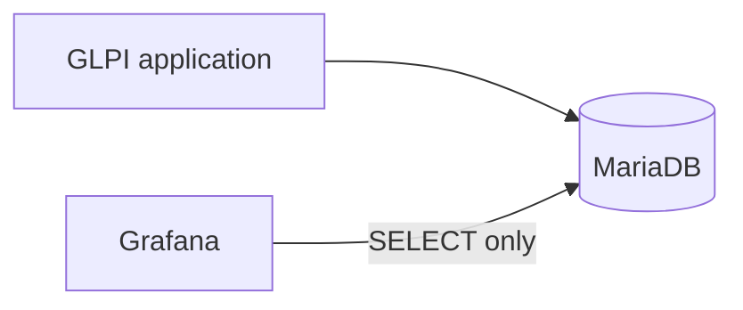

# Arquitetura

O diagrama abaixo representa a arquitetura lógica: o Grafana lê o banco externo do GLPI. A topologia de rede mostrada adiante é a implantação validada atual, não um requisito universal.

O GLPI continua sendo uma aplicação externa já existente. Seu banco também é externo; a stack principal do Compose contém apenas o Grafana. O Grafana consulta o MySQL diretamente por meio de seu datasource nativo, mantendo a primeira versão simples e evitando um backend personalizado, ETL e um armazenamento adicional de métricas.

O Prometheus não é usado porque o foco inicial são dados relacionais de chamados, e não telemetria de infraestrutura em séries temporais. A API do GLPI não é usada porque o caminho inicial escolhido é SQL read-only no banco de relatórios. O acesso ao banco deve usar uma conta dedicada com o mínimo de privilégios. O SQL direto vincula as queries ao schema do GLPI; por isso, o discovery do schema e da versão deve preceder a implementação das métricas.

No ambiente de testes, a conectividade entre o Grafana e o banco externo foi validada. O Compose usa `network_mode: host` nesta implantação; essa decisão é específica do ambiente e não deve ser generalizada para outras instalações.

A conta dedicada do datasource tem somente acesso read-only ao MariaDB. A autenticação, a conectividade e uma query read-only foram validadas. O datasource provisionado **GLPI MySQL** informa conexão saudável usando acesso proxy do MySQL.

Na implantação atual de produção, o Grafana está em execução e escuta somente na interface de loopback. O acesso externo passa por um reverse proxy Nginx, e o firewall permite acesso somente a origens internas/autorizadas. O serviço do Grafana não é exposto diretamente. O MariaDB também permanece acessível localmente, por uma conta dedicada read-only e sem exposição externa.

Essa topologia é específica do ambiente atual. Ela poderá evoluir futuramente para acesso por DNS e HTTPS; essa evolução ainda não está configurada.

O endpoint `/api/health` respondeu com o banco interno do Grafana saudável. O `.env` de produção é local, separado dos demais ambientes e não versionado. A topologia atual é a primeira versão de produção estável; DNS e HTTPS poderão ser avaliados futuramente. Consulte [Production Readiness](production-readiness.md).

## Requisitos, decisões atuais e portabilidade

### Requisitos do projeto

- Um Grafana provisionado com datasource MySQL compatível com o MariaDB usado pela instalação GLPI.
- Conectividade até o banco e uma conta dedicada com acesso somente de leitura.
- Configuração local por ambiente; `.env` e credenciais reais ficam fora do Git.
- Preservação do escopo de entidade e validação das queries contra o schema real.

### Decisões de arquitetura portáveis

O Grafana consulta diretamente o banco externo via SQL read-only; dashboards e datasource são provisionados por arquivos versionados. O uso de Nginx, DNS, HTTPS ou um firewall específico não é requisito universal do projeto. O acesso precisa ser protegido segundo a política do ambiente.

### Específico da configuração e implantação atuais

- `compose.yaml` fixa `grafana/grafana:13.2.2`, define `container_name` e usa `network_mode: host`. Host networking foi a solução do ambiente atual para alcançar o MariaDB local; não é requisito da arquitetura e limita a portabilidade do Compose.
- A imagem fixa o endereço HTTP do Grafana à interface de loopback; a porta HTTP segue o default do Grafana, pois não é configurada explicitamente pelo Compose. A implantação de produção validada usa Nginx e firewall como controles de entrada. Essas escolhas podem ser substituídas por uma topologia segura adequada a outro ambiente.
- Ubuntu Server 24.04 LTS é a base usada no runbook de testes, não uma exigência universal do modelo Grafana → MariaDB. O caminho `/opt` é apenas um exemplo de instalação. O `container_name` fixo pode conflitar se forem iniciadas cópias paralelas do Compose.
- A CI atual usa o runner GitHub-hosted `ubuntu-latest`, Python 3.12 e Node.js 22. São versões do ambiente de validação, não dependências de runtime do dashboard.
- MariaDB é externo e sua versão não é fixada pelo repositório. A versão da instalação GLPI validada também não é declarada como matriz de compatibilidade.
- O UID `glpi-mysql` é um identificador interno referenciado pelos dashboards; se for customizado, o datasource provisioning e todas as referências devem ser atualizados em conjunto. Os UIDs dos dashboards também são identificadores locais do repositório.

### Compatibilidade do GLPI e do banco

As queries foram desenvolvidas e comparadas com uma instalação específica. Tabelas, colunas, relações, valores de status/prioridade e a disponibilidade de `glpi_entities.completename` não devem ser tratados como universais. Execute `sql/discovery/` e valide os domínios na interface da instalação antes de reutilizar ou adaptar métricas. Os scripts também consultam versão do servidor, charset, collation e timezone; esses resultados não são publicados. Considere o timezone do banco e do dashboard ao interpretar datas e `NOW()`.
