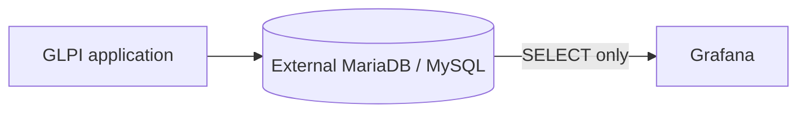

# Architecture

GLPI remains an existing external application. Its database is also external; Compose contains only Grafana. Grafana queries MySQL directly through its native data source, keeping the first version small and avoiding a custom backend, ETL, and an additional metrics store.

Prometheus is not used because the initial subject is relational ticket data, not time-series infrastructure telemetry. The GLPI API is not used because read-only SQL against the reporting database is the selected initial path. Database access must use a dedicated least-privilege account. Direct SQL couples queries to the GLPI schema, so schema and version discovery must precede metric implementation.

Grafana can start without the external database being reachable; data queries will fail until connectivity and credentials are configured.
