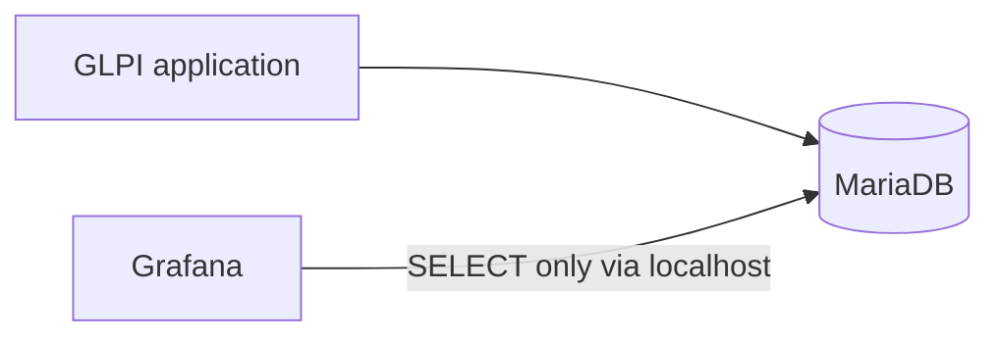

# Arquitetura

O GLPI continua sendo uma aplicação externa já existente. Seu banco também é externo; a stack principal do Compose contém apenas o Grafana. O Grafana consulta o MySQL diretamente por meio de seu datasource nativo, mantendo a primeira versão simples e evitando um backend personalizado, ETL e um armazenamento adicional de métricas.

O Prometheus não é usado porque o foco inicial são dados relacionais de chamados, e não telemetria de infraestrutura em séries temporais. A API do GLPI não é usada porque o caminho inicial escolhido é SQL read-only no banco de relatórios. O acesso ao banco deve usar uma conta dedicada com o mínimo de privilégios. O SQL direto vincula as queries ao schema do GLPI; por isso, o discovery do schema e da versão deve preceder a implementação das métricas.

No ambiente de testes atual, GLPI, MariaDB e Grafana executam no mesmo host Linux. O MariaDB permanece vinculado a `127.0.0.1:3306`, e o Grafana usa `network_mode: host` para alcançar o banco local sem expor a porta 3306. A conectividade foi validada. Essa decisão é específica deste ambiente.

A conta dedicada do datasource tem somente acesso read-only ao MariaDB. A autenticação, a conectividade e uma query read-only foram validadas. O datasource provisionado **GLPI MySQL** informa conexão saudável usando acesso proxy do MySQL.

Na topologia atual de produção, o Grafana escuta somente em `127.0.0.1:3000`. O acesso externo passa por um reverse proxy Nginx, que publica o serviço em uma porta HTTP dedicada; o firewall permite acesso somente a redes internas autorizadas. A porta 3000 não é exposta externamente. O MariaDB permanece em `127.0.0.1:3306` com usuário read-only, sem exposição externa.

Essa topologia é específica do ambiente atual. Ela poderá evoluir futuramente para acesso por DNS e HTTPS; essa evolução ainda não está configurada.

O Grafana pode iniciar sem que o MariaDB esteja acessível; as queries de dados exigem conectividade e credenciais locais válidas. A conta administrativa do Grafana e o usuário read-only do MariaDB são separados, com credenciais distintas.

A topologia de produção atual usa Nginx como reverse proxy HTTP. O uso de DNS e HTTPS poderá ser avaliado como evolução futura; consulte [Production Readiness](production-readiness.md).
