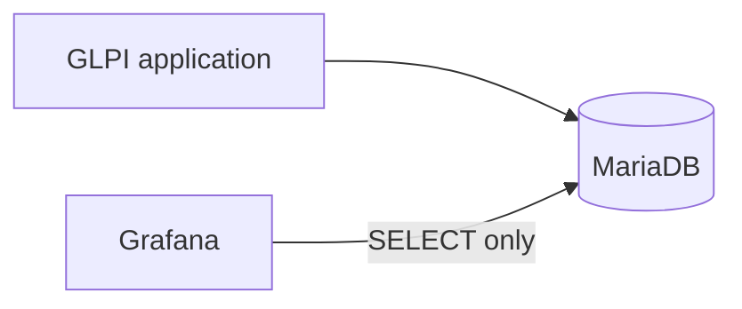

# Arquitetura

O GLPI continua sendo uma aplicação externa já existente. Seu banco também é externo; a stack principal do Compose contém apenas o Grafana. O Grafana consulta o MySQL diretamente por meio de seu datasource nativo, mantendo a primeira versão simples e evitando um backend personalizado, ETL e um armazenamento adicional de métricas.

O Prometheus não é usado porque o foco inicial são dados relacionais de chamados, e não telemetria de infraestrutura em séries temporais. A API do GLPI não é usada porque o caminho inicial escolhido é SQL read-only no banco de relatórios. O acesso ao banco deve usar uma conta dedicada com o mínimo de privilégios. O SQL direto vincula as queries ao schema do GLPI; por isso, o discovery do schema e da versão deve preceder a implementação das métricas.

No ambiente de testes, a conectividade entre o Grafana e o banco externo foi validada. O Compose usa `network_mode: host` nesta implantação; essa decisão é específica do ambiente e não deve ser generalizada para outras instalações.

A conta dedicada do datasource tem somente acesso read-only ao MariaDB. A autenticação, a conectividade e uma query read-only foram validadas. O datasource provisionado **GLPI MySQL** informa conexão saudável usando acesso proxy do MySQL.

Na implantação atual de produção, o Grafana está em execução e escuta somente na interface de loopback. O acesso externo passa por um reverse proxy Nginx, e o firewall permite acesso somente a origens internas/autorizadas. O serviço do Grafana não é exposto diretamente. O MariaDB também permanece acessível localmente, por uma conta dedicada read-only e sem exposição externa.

Essa topologia é específica do ambiente atual. Ela poderá evoluir futuramente para acesso por DNS e HTTPS; essa evolução ainda não está configurada.

O endpoint `/api/health` respondeu com o banco interno do Grafana saudável. O `.env` de produção é local, separado dos demais ambientes e não versionado. A topologia atual é a primeira versão de produção estável; DNS e HTTPS poderão ser avaliados futuramente. Consulte [Production Readiness](production-readiness.md).
